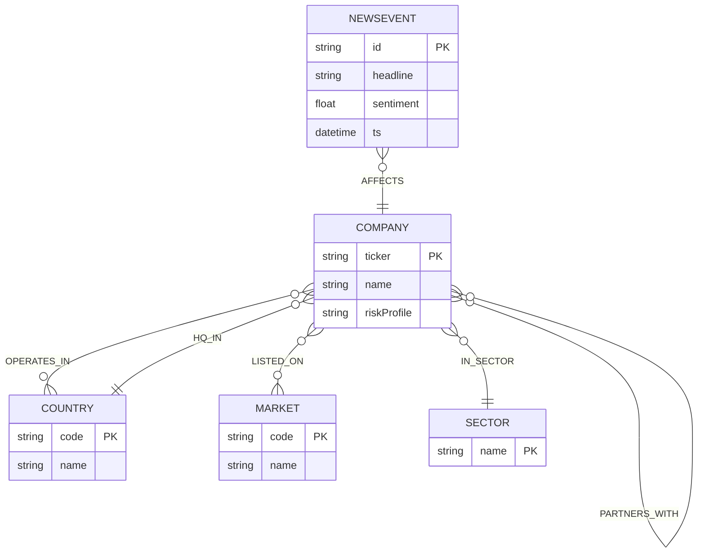

# Graph DB Schema (Neo4j) — Finance Contagion Demo

This document describes the graph schema used by the demo dataset in `neo4j/import/seed.cypher`.

## Overview

The schema models:

- **Companies** (the main entities we score)
- **Markets**, **Countries**, **Sectors** (context)
- **News events** that directly impact a company
- **Inter-company links** (ownership, partnerships, supply chain) used for propagation

## Node labels and key properties

### `Company`
- Key: `ticker` (string, unique)
- Properties:
  - `ticker` (string)
  - `name` (string)
  - `riskProfile` (string, optional)

### `Country`
- Key: `code` (string, unique)
- Properties:
  - `code` (string)
  - `name` (string)

### `Market`
- Key: `code` (string, unique)
- Properties:
  - `code` (string)
  - `name` (string)

### `Sector`
- Key: `name` (string, unique)
- Properties:
  - `name` (string)

### `NewsEvent`
- Key: `id` (string, unique)
- Properties:
  - `id` (string)
  - `source` (string, e.g. RSS feed name)
  - `sourceFeed` (string URL of the RSS feed)
  - `url` (string URL of the article)
  - `headline` (string)
  - `summary` (string; short, original demo summary)
  - `sentiment` (number; negative = bad, positive = good)
  - `ts` (datetime)

## Relationship types and properties

### `(:Company)-[:LISTED_ON]->(:Market)`
- Meaning: company is listed on an exchange/market
- Properties: none

### `(:Company)-[:HQ_IN]->(:Country)`
- Meaning: company headquarters location
- Properties: none

### `(:Company)-[:OPERATES_IN]->(:Country)`
- Meaning: company has operations footprint in a country
- Properties: none

### `(:Company)-[:IN_SECTOR]->(:Sector)`
- Meaning: company belongs to a sector
- Properties: none

### `(:Company)-[:OWNS {pct}]->(:Company)`
- Meaning: equity ownership link
- Properties:
  - `pct` (number, percentage 0..100)

### `(:Company)-[:SUPPLIES_TO {criticality}]->(:Company)`
- Meaning: supply chain link (from supplier to customer)
- Properties:
  - `criticality` (number, typically 0..1)

### `(:Company)-[:PARTNERS_WITH {strength}]->(:Company)`
- Meaning: partnership link
- Properties:
  - `strength` (number, typically 0..1)

### `(:NewsEvent)-[:AFFECTS {directImpact}]->(:Company)`
- Meaning: a news event directly affects one company
- Properties:
  - `directImpact` (number, typically 0..1)

### `(:NewsEvent)-[:ASSOCIATED_WITH]->(:Market)`
- Meaning: a market tag to make Browser visualization and storytelling easier (not used by the scoring query)
- Properties: none

## Constraints

The seed script and the app create these constraints:

- `Company(ticker)` unique
- `Country(code)` unique
- `Market(code)` unique
- `Sector(name)` unique
- `NewsEvent(id)` unique

## Mermaid ER diagram

This diagram shows the logical schema (labels, keys, and relationship types).



Notes:
- Cardinalities are illustrative. The demo data uses 1 HQ country and 1 sector per company, but the schema does not enforce that (it’s a modeling convention).
- For `OWNS`, `SUPPLIES_TO`, and `PARTNERS_WITH`, direction matters semantically even though traversal for analytics may use undirected patterns.

## Practical “Graph mode” queries

Neo4j Browser only shows the **Graph** view if you return nodes/relationships/paths.

### List companies (graph)
```cypher
MATCH (c:Company) RETURN c ORDER BY c.ticker LIMIT 50;
```

### List news events and what they affect (graph)
```cypher
MATCH (n:NewsEvent)-[a:AFFECTS]->(c:Company)
RETURN n, a, c
ORDER BY n.id;
```

### Visualize which markets an event is associated with (graph)
```cypher
MATCH (n:NewsEvent)-[r:ASSOCIATED_WITH]->(m:Market)
RETURN n, r, m
ORDER BY n.id;
```

### Show propagation edges (graph)
```cypher
MATCH (a:Company)-[r:OWNS|PARTNERS_WITH|SUPPLIES_TO]->(b:Company)
RETURN a, r, b;
```

### Visualize the 0..2 hop neighborhood from the negative news event (graph)
```cypher
MATCH (n:NewsEvent {id:'N-2025-12-18-001'})-[a:AFFECTS]->(c0:Company)
MATCH p=(c0)-[:OWNS|PARTNERS_WITH|SUPPLIES_TO*0..2]-(c:Company)
RETURN n, a, p;
```

### Visualize the centered neighborhood (starting at NVDA)
```cypher
MATCH p=(c0:Company {ticker:'NVDA'})-[:OWNS|PARTNERS_WITH|SUPPLIES_TO*0..2]-(c:Company)
RETURN p;
```
